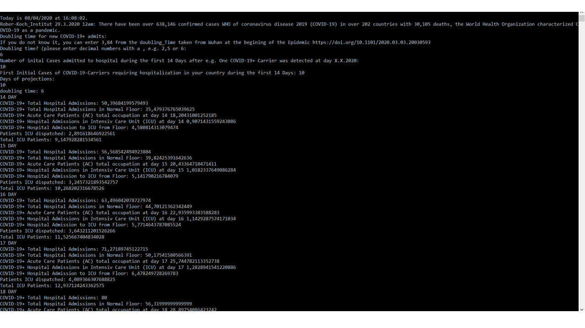

- En Español haga click [aquí](#predicción-de-la-admisión-de-pacientes-covid)

- Clicken Sie auf [Deutsch](#berechnung-der-covid-patienten-aufnahme-auf-icu) 

# ICU-Patient-Admission-Prediction-Covid-19+
To do an estimation of how many patients are being admitted to the intensive care unit or acute care patients is essential for hospital planning during the period of NPI (Non-Pharmacological Interventions) and also during their release (Lockdown Release). For this purpose the doubling time is an essential parameter.

This App created in Microsoft Visual Studio 2019 is a Console App (.NET Core) written in C sharp. It can run on Windows, Linux and MacOs. 

#### MacOS: 
- https://dotnet.microsoft.com/download/dotnet-core/3.1
- https://www.mono-project.com/docs/about-mono/supported-platforms/macos/
#### Linux: 
- https://dotnet.microsoft.com/download

# Background
A model of prediction of ICU Beds needed was online on March 26th 2020 as a pre-print: https://doi.org/10.1101/2020.03.24.20042762 

Corresponding Author: David Scheinker from Lucile Packard Children’s Hospital, Stanford, CA. 
First Authors: Teng Zhang and Kelly McFarlane, Harvard Medical School, Standford Department of Management Science and Engineering, Stanford University School of Engineering, Stanford, CA.
#### To view the on-line calculator please click on this link: 
https://surf.stanford.edu/covid-19-tools/covid-19-hospital-projections/ 

#### The doubling time is an essential parameter for understanding how all of us are being affected by SARS-Cov-2. For further reading follow these publications: 

Quantifying SARS-CoV-2 transmission suggests epidemic control with digital contact tracing
Luca Ferretti1,*, Chris Wymant1,*, Michelle Kendall1, Lele Zhao1, Anel Nurtay1, Lucie Abeler-Dörner1, Michael Parker2, David Bonsall1,3,†, Christophe Fraser1,4,†,‡
Science  31 Mar 2020: eabb6936 DOI: 10.1126/science.abb6936
https://science.sciencemag.org/content/early/2020/03/30/science.abb6936

I. Dorigatti, L. Okell, A. Cori, N. Imai, M. Baguelin, S. Bhatia, A. Boonyasiri, Z. Cucunubá, G. Cuomo-Dannenburg, R. FitzJohn, H. Fu, K. Gaythorpe, A. Hamlet, W. Hinsley, N. Hong, M. Kwun, D. Laydon, G. Nedjati-Gilani, S. Riley, S. van Elsland, E. Volz, H. Wang, R. Wang, C. Walters, X. Xi, C. Donnelly, A. Ghani, N. Ferguson, Report 4: Severity of 2019-Novel Coronavirus (nCoV) (10 February 2020); www.imperial.ac.uk/media/imperial-college/medicine/sph/ide/gida-fellowships/Imperial-College-COVID19-severity-10-02-2020.pdf.

#### Changes: The ConsoleApp1's (faster) Output prints the number of ICU beds accumulation over time according to the doubling time of disease transmision. The ConsoleApp1 (faster) does not include the percentage of ICU beds needed due to NON-COVID-19+ Patients (unlike from https://doi.org/10.1101/2020.03.24.20042762). 
 
# Run this App doing the following steps: 
### 1. Clone or Download all the files into one folder. 
### 2. Go to the folder [\Application](https://github.com/elap2/ICU-Patient-Admission-Prediction-Covid-19-/tree/master/Application) and run ConsoleApp1.exe within e.g. *C:\YourDownloadPath*\Application\ConsoleApp1.exe

> The source code is the file Program.cs at [\ConsoleApp1](https://github.com/elap2/ICU-Patient-Admission-Prediction-Covid-19-/tree/master/ConsoleApp1/ConsoleApp1)

# What is the advantage of this App?

## The ConsoleApp1 
- *does not need to be online* 
- *It is straight forward and it's output gives you the number of patients admitted to the hospital, to the ICU, to the AC (acute care beds during the days projected)*

# Ouput example:



# Parameters:
### All parameters are taken from the pre-print https://doi.org/10.1101/2020.03.24.20042762 
<table>
    <thead>
        <tr>
            <th colspan="3">Table 1: Patient Cohorts and Length of Stay Estimates</th>
        </tr>
    </thead>
    <tbody>
        <tr>
            <td>COVID Patient Cohorts
                <table>
                    <tbody>
                        <tr><th>Index</th><th>Path</th><th>Fraction of Patients %</th></tr>
                        <tr><td>1</td><td>Floor</td><td>70.4</td></tr>
                        <tr><td>2</td><td>Floor->ICU->Floor</td><td>13.0</td></tr>
                        <tr><td>3</td><td>Floor->ICU</td><td>1.8</td></tr>
                        <tr><td>4</td><td>ICU->Floor</td><td>13.0</td></tr>
                        <tr><td>5</td><td>ICU</td><td>1.8</td></tr>
                    </tbody>
                </table>
            </td>
            <td>(Length of Stay) Estimates in Model Days
            <table>
                    <tbody>
                      <tr><th>LOS Floor</th><th>LOS ICU</th><th>LOS Floor</th><th>Total LOS</th></tr>
                      <tr><td>5</td><td>  </td><td> </td><td>5</td></tr>
                      <tr><td>4</td><td>9</td><td>4</td><td>17</td></tr>
                      <tr><td>6</td><td>9</td><td> </td><td>15</td></tr>
                      <tr><td> </td><td>9</td><td>4</td><td>13</td></tr>
                      <tr><td> </td><td>11</td><td> </td><td>11</td></tr>  
                    </tbody>
                </table>
            </td>            
        </tr>
    </tbody>
</table>

# Source Code below
>  [\ConsoleApp1\Program.cs](https://github.com/elap2/ICU-Patient-Admission-Prediction-Covid-19-/tree/master/ConsoleApp1/ConsoleApp1)
```C#
namespace ConsoleApp1
{
    using System;

    internal class Program
    {
        /// <summary>
        /// Total ICU beds.
        /// </summary>
        internal const int TotalICUBeds = 640;

        /// <summary>
        /// fraction of ICU occupancy COVID 19 neg.
        /// </summary>
        internal const double FractionOfICUOccupancyCOVID19Neg = 0.55;

        /// <summary>
        /// Lenght of stay 5 days.
        /// </summary>
        private const double LOSFloor1 = 5;

        /// <summary>
        /// Lenght of stay 11 days.
        /// </summary>
        private const double LOSICU11d = 11;

        /// <summary>
        /// Lenght of stay 9 days.
        /// </summary>
        private const double LOSICU9d = 9;

        /// <summary>
        /// Length of Stay 4 days.
        /// </summary>
        private const double LOSFloor2 = 4;

        /// <summary>
        /// Length of Stay 6 days.
        /// </summary>
        private const double LOSFloor3 = 6;

        /// <summary>
        /// Length of Stay 4 days.
        /// </summary>
        private const double LOSFloor4 = 4;

        /// <summary>
        /// Cohort 1.
        /// </summary>
        private const double FractionFloor = 0.704;

        /// <summary>
        /// Cohort 2.
        /// </summary>
        private const double FractionFloorIcuFloor = 0.13;

        /// <summary>
        /// Cohort 3.
        /// </summary>
        private const double FractionFloorIcu = 0.018;

        /// <summary>
        /// Cohort 4.
        /// </summary>
        private const double FractionIcuFloor = 0.13;

        /// <summary>
        /// Cohort 5.
        /// </summary>
        private const double FractionIcu = 0.018;

        private const string V1 = " DAY";
        private const string V2 = "First Initial Cases of COVID-19-Carriers requiring hospitalization in your country during the first 14 Days: ";

        private static double doublingTime;
        private static int initialCases;
        private static int days;

        internal static void Main()
        {
            DateTime dat = DateTime.Now;
            Console.WriteLine("\n\nToday is {0:d} at {0:T}.".Normalize(), dat);
            Console.WriteLine("Rober-Koch_Institut 29.3.2020 12am: There have been over 638,146 confirmed cases WHO " +
                "of coronavirus disease 2019 (COVID-19) in over 202 countries with 30,105 deaths, the World Health Organization characterized COVID-19 as a pandemic.".Normalize());
            Get_the_doubling_time();
            Console.WriteLine("doubling time: " + doublingTime);

            for (int cnt = 14; cnt <= 14 + days; ++cnt)
            {
                double pow_ab = initialCases * Math.Pow(2, cnt / doublingTime); // Total COVID-19(+) Admissions to Hospital

                double cohort_1_dispatched = AC_patients_discount_Cohort1(cnt, initialCases); // dispatched patients from AC 5 days ago
                double aC_patients_total = (pow_ab * FractionFloor) - cohort_1_dispatched + Flow_From_ICU_to_Floor(cnt, initialCases); // Actual occupation of AC

                double dispatched_icu_beds = Icu_patients_discount_Cohort5(cnt, initialCases);
                double cohort_2_icu = Cohort_2(cnt, initialCases); // +++
                double icu_patients_total = (pow_ab * FractionIcu) + (pow_ab * FractionIcuFloor) - dispatched_icu_beds + cohort_2_icu;

                Console.WriteLine("{0}{1}".Normalize(), cnt, V1);
                Console.WriteLine("COVID-19+ Total Hospital Admissions: {0}".Normalize(), pow_ab);
                Console.WriteLine("COVID-19+ Total Hospital Admissions in Normal Floor: {0}".Normalize(), pow_ab * FractionFloor);
                Console.WriteLine("COVID-19+ Acute Care Patients (AC) total occupation at day {0} {1}".Normalize(), cnt, aC_patients_total);
                Console.WriteLine("COVID-19+ Hospital Admissions in Intensiv Care Unit (ICU) at day {0} {1}".Normalize(), cnt, pow_ab * FractionIcu);
                Console.WriteLine("COVID-19+ Hospital Admission to ICU from Floor: {0}".Normalize(), cohort_2_icu);
                Console.WriteLine("Patients ICU dispatched: {0}".Normalize(), dispatched_icu_beds);
                Console.WriteLine("Total ICU Patients: {0}".Normalize(), icu_patients_total);
            }

            Console.ReadLine();
        }
        /// <summary>
        /// gets doubling the time.
        /// </summary>
        private static void Get_the_doubling_time()
        {
            Console.WriteLine("Doubling time for new COVID-19+ admits: ".Normalize());
            Console.WriteLine("If you do not know it, you can enter 3,84 from the doubling_Time taken from Wuhan at the begining of the Epidemic https://doi.org/10.1101/2020.03.03.20030593".Normalize());

            Console.WriteLine("Doubling time of New Covid Admits? (please enter decimal numbers with a , e.g. 2,5 or 6: ".Normalize());
            string doubling_time_string = Console.ReadLine();

            while (string.IsNullOrEmpty(doubling_time_string) || (!double.TryParse(doubling_time_string, out doublingTime)))
            {
                Console.WriteLine("Number invalid".Normalize());
                doubling_time_string = Console.ReadLine();
            }

            doublingTime = Convert.ToDouble(doubling_time_string);

            Console.WriteLine("Number of inital Cases admitted to hospital during the first 14 Days after e.g. One COVID-19+ Carrier was detected at day X.X.2020: ".Normalize());
            string string_initial_cases = Console.ReadLine();

            while (string.IsNullOrEmpty(string_initial_cases) || (!int.TryParse(string_initial_cases, out initialCases)))
            {
                Console.WriteLine("Number invalid".Normalize());
                string_initial_cases = Console.ReadLine();
            }

            initialCases = Convert.ToInt32(string_initial_cases);
            Console.WriteLine(V2 + initialCases.ToString().Normalize());

            Console.WriteLine("Days of projections: ".Normalize()); // days of stay in ICU
            string string_days = Console.ReadLine();
            while (string.IsNullOrEmpty(string_days) || (!int.TryParse(string_days, out days)))
            {
                Console.WriteLine("Number invalid".Normalize());
                string_days = Console.ReadLine();
            }

            days = Convert.ToInt32(string_days);

        }

        /// <summary>
        /// ICU patients discount Chohort 5 dispatched from ICU.
        /// </summary>
        /// <param name="actual_day_of_epidemic">Actual day of epidemic.</param>
        /// <param name="initial_cases">Initial dases.</param>
        /// <returns>Dispatched from ICU.</returns>
        private static double Icu_patients_discount_Cohort5(int actual_day_of_epidemic, int initial_cases)
        {
            double dispatched_icu_patients_cohort_5 = initial_cases * Math.Pow(2, (actual_day_of_epidemic - LOSICU11d) / doublingTime) * FractionIcu; // Cohort5
            double dispatched_icu_patients_cohort_2_and_4 = initial_cases * Math.Pow(2, (actual_day_of_epidemic - LOSICU9d) / doublingTime) * (FractionFloorIcuFloor + FractionFloorIcu); // Cohort 2

            double dispatched_icu_patients = dispatched_icu_patients_cohort_5 + dispatched_icu_patients_cohort_2_and_4;

            return dispatched_icu_patients;
        }

        /// <summary>
        /// AC patients discount Cohort 1 dismissed from hospital.
        /// </summary>
        /// <param name="actual_day_of_epidemic">Actual epidemic day.</param>
        /// <param name="initial_cases">Inital cases.</param>
        /// <returns>dismissed from hospital.</returns>
        private static double AC_patients_discount_Cohort1(int actual_day_of_epidemic, int initial_cases) // Dismiss from Hospital
        {
            double dispatched_AC_patients = initial_cases * Math.Pow(2, (actual_day_of_epidemic - LOSFloor1) / doublingTime) * FractionFloor;

            return dispatched_AC_patients;
        }

        private static double Cohort_2(int actual_day_of_epidemic, int initial_cases) // Flow of Floor patients to the ICU
        {
            double floor_to_ICU_flow_Cohort2 = initial_cases * Math.Pow(2, (actual_day_of_epidemic - LOSFloor2) / doublingTime) * FractionFloorIcuFloor; // AC Patients 4 days ago going to the ICU
            double floor_to_ICU_flow_Cohort3 = initial_cases * Math.Pow(2, (actual_day_of_epidemic - LOSFloor3) / doublingTime) * FractionFloorIcu; // AC Patients 6 days ago going to the ICU
            double floor_to_ICU_flow = floor_to_ICU_flow_Cohort2 + floor_to_ICU_flow_Cohort3;
            return floor_to_ICU_flow;
        }

        private static double Flow_From_ICU_to_Floor(int actual_day_of_epidemic, int initial_cases) // Flow of Patients from ICU to Floor
        {
            double income_AC_patients = initial_cases * Math.Pow(2, (actual_day_of_epidemic - LOSICU9d) / doublingTime) * (FractionFloorIcuFloor + FractionFloorIcu); // flow to floor
            return income_AC_patients;
        }


    }
}


 ```
# Predicción de la admisión de pacientes COVID
Hacer una estimación de cuántos pacientes seran ingresados a la unidad de terapia intensiva (ICU) o de cuidados intensivos (AC) es esencial para el planeamiento hospitalario durante el periodo de intervenciones no farmacológicas (NPI) y también durante su liberación (Liberación de la "Cuarentena"). Para este propósito el tiempo de duplicación de la enfermedad COVID19 es esencial.

Este App es creado en Microsoft Visual Studio 2019 como App Consola (.NET Core) escrito en C sharp. Puede correr en Windows, Linux y MacOs. 

#### MacOS: https://dotnet.microsoft.com/download/dotnet-core/3.1
#### Linux: https://dotnet.microsoft.com/download

# Cuestión
Un modelo de predicción de la necesidad de camas de terapia intensiva ICU se ha puesto online en Marzo 26 de 2020 como pre-print: https://doi.org/10.1101/2020.03.24.20042762 

Autor: David Scheinker from Lucile Packard Children’s Hospital, Stanford, CA. 
Primeros Autores: Teng Zhang and Kelly McFarlane, Harvard Medical School, Standford Department of Management Science and Engineering, Stanford University School of Engineering, Stanford, CA.
#### Para ver el calculador on-line por favor cliquear el link:
https://surf.stanford.edu/covid-19-tools/covid-19-hospital-projections/ 

#### El tiempo de duplicación es un parámetro esencial para entender cómo todos nosotros estamos siendo afectados por el SARS-Cov-2. Para mayor profundidad léase los siguientes artículos: 

Quantifying SARS-CoV-2 transmission suggests epidemic control with digital contact tracing
Luca Ferretti1,*, Chris Wymant1,*, Michelle Kendall1, Lele Zhao1, Anel Nurtay1, Lucie Abeler-Dörner1, Michael Parker2, David Bonsall1,3,†, Christophe Fraser1,4,†,‡
Science  31 Mar 2020: eabb6936 DOI: 10.1126/science.abb6936
https://science.sciencemag.org/content/early/2020/03/30/science.abb6936

I. Dorigatti, L. Okell, A. Cori, N. Imai, M. Baguelin, S. Bhatia, A. Boonyasiri, Z. Cucunubá, G. Cuomo-Dannenburg, R. FitzJohn, H. Fu, K. Gaythorpe, A. Hamlet, W. Hinsley, N. Hong, M. Kwun, D. Laydon, G. Nedjati-Gilani, S. Riley, S. van Elsland, E. Volz, H. Wang, R. Wang, C. Walters, X. Xi, C. Donnelly, A. Ghani, N. Ferguson, Report 4: Severity of 2019-Novel Coronavirus (nCoV) (10 February 2020); www.imperial.ac.uk/media/imperial-college/medicine/sph/ide/gida-fellowships/Imperial-College-COVID19-severity-10-02-2020.pdf.

#### Cambios: El Output del ConsoleApp1's imprime directamente los números de camas de ICU acumulados durante el tiempo de acuerdo al tiempo de duplicación de la transmisión. El ConsoleApp1 no incluye los porcentajes de camas de ICU necesarias por parte de pacientes NO-COVID-19+ (en contraste con el calculador de https://doi.org/10.1101/2020.03.24.20042762). 
 
# Correr esta App haciendo los siguientes pasos: 
### 1. Clona or Descarga todos los archivos en una Directorio. 
### 2. Ir al directorio [\Application](https://github.com/elap2/ICU-Patient-Admission-Prediction-Covid-19-/tree/master/Application) y correr directamente el ConsoleApp1.exe dentro de por ej. *C:\TuDirectorio*\Application\ConsoleApp1.exe

> El código fuente es el archivo Program.cs en [\ConsoleApp1](https://github.com/elap2/ICU-Patient-Admission-Prediction-Covid-19-/tree/master/ConsoleApp1)

# Cual es la ventaja de este App?

## ConsoleApp1 
- *no necesita estar online* 
- *Es simple de usar y sus resultados se expresan en número de pacientes ingresados al hospital, a la ICU (terapia de cuidados intensivos), a la AC (terapia intermedia) durante los días proyectados de interés)*

# Ejemplo y Código fuente
> ir a Output Example
> Código fuente se ve arriba

# Berechnung der COVID Patienten-Aufnahme auf ICU

Eine Vorhersage der Anzahl von intensivpflichtigen Patienten und der hospitalisierten Patienten auf Überwachungsstationen ist während der sozialen Distanzierungsmaßnahmen und deren Lockerung ein wesentlicher Teil der Organisation der Krankenhausbetten. Aus diesem Grund ist es die Verfopplungszeit ein wichtiger Parameter dieser Berechnung.

Die in Microsoft Visual Studio 2019 entwickelte Console App (.NET Core) ist in C sharp geschrieben. Es kann in Windows, MacOS und Linux laufen.

#### MacOS: 
- https://dotnet.microsoft.com/download/dotnet-core/3.1
- https://www.mono-project.com/docs/about-mono/supported-platforms/macos/
#### Linux: 
- https://dotnet.microsoft.com/download

# Hintergrund
Ein prädiktives Modell, welches die Belegungsquote von Intensivbetten je nach Verdopplungszeit berechnet, wurde online am 26.3.20 herausgegeben: https://doi.org/10.1101/2020.03.24.20042762 

Author: David Scheinker, Lucile Packard Children’s Hospital, Stanford, CA. 
Erster Author: Teng Zhang and Kelly McFarlane, Harvard Medical School, Standford Department of Management Science and Engineering, Stanford University School of Engineering, Stanford, CA.

#### Um den on-line Rechner zu sehen bitte clicken Sie bitte in den unten stehenden Link:
https://surf.stanford.edu/covid-19-tools/covid-19-hospital-projections/

#### Die Verdopplungszeit ist ein wichtiges Parameter, um zu verstehen, wie die Ausbreitung von SARS-Cov-2 uns beeinflußt. Weitere wichtige Lesewerke finden Sie unten:

Quantifying SARS-CoV-2 transmission suggests epidemic control with digital contact tracing
Luca Ferretti1,*, Chris Wymant1,*, Michelle Kendall1, Lele Zhao1, Anel Nurtay1, Lucie Abeler-Dörner1, Michael Parker2, David Bonsall1,3,†, Christophe Fraser1,4,†,‡
Science  31 Mar 2020: eabb6936 DOI: 10.1126/science.abb6936
https://science.sciencemag.org/content/early/2020/03/30/science.abb6936

I. Dorigatti, L. Okell, A. Cori, N. Imai, M. Baguelin, S. Bhatia, A. Boonyasiri, Z. Cucunubá, G. Cuomo-Dannenburg, R. FitzJohn, H. Fu, K. Gaythorpe, A. Hamlet, W. Hinsley, N. Hong, M. Kwun, D. Laydon, G. Nedjati-Gilani, S. Riley, S. van Elsland, E. Volz, H. Wang, R. Wang, C. Walters, X. Xi, C. Donnelly, A. Ghani, N. Ferguson, Report 4: Severity of 2019-Novel Coronavirus (nCoV) (10 February 2020); www.imperial.ac.uk/media/imperial-college/medicine/sph/ide/gida-fellowships/Imperial-College-COVID19-severity-10-02-2020.pdf.

#### Veränderungen
Das Output von ConsoleApp1 druckt die direkte Zahlen der akkumulierten ICU Patienten in einem bestimmten angegeben Zeitfenster je nach Verdopplungszeit und initialer hospitalisierten COVID-Patienten aus. Das ConsoleApp1 berücksichtigt die Prozentzahl der Nicht-COVID-19+ nicht im Gegensatz zu dem Rechner auf folgendem Link: https://doi.org/10.1101/2020.03.24.20042762). 
 
# Herunterladen: 
### 1. Die Dateien des Archiv Herunterladen od. das Archiv klonieren.
### 2. Gehen Sie bitte zu dem Ordner [\Application](https://github.com/elap2/ICU-Patient-Admission-Prediction-Covid-19-/tree/master/Application) und die Datei ConsoleApp1.exe im *C:\DeinOrdner*\Application\ConsoleApp1.exe Öffnen.

# Vorteile dieser App im Vergleich zu dem on-line Rechner

## ConsoleApp1 
- *kann off-line bei schwankender Internetverbindung laufen* 
- *Es hat eine einfache Anwendung und die Ergebnisse werden in Zahlen der ICU und AC (Überwachungsstation) direkt augedrückt*

# Das Beispiel und das Algorythmus
> Beides oben stehend
